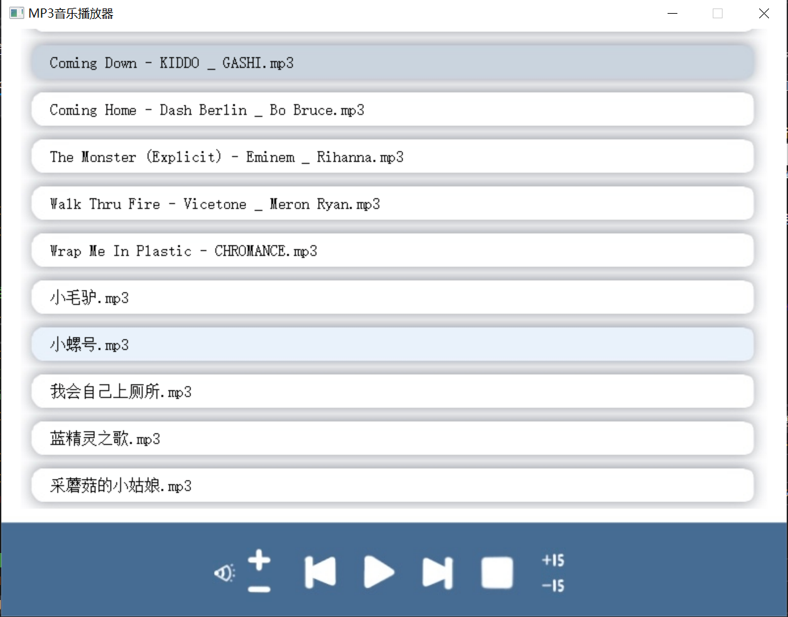

# MP3-player
与小组成员合作开发的项目，一个简单的MP3音乐播放器

>  :rocket:实现了对MP3音乐文件的播放 
>
> :rocket:实现了音乐播放器大部分的功能，包括:
>
> :rocket: 暂停、停止、上一曲、下一曲、增大音量、减小音量、快进、快退
>
> :rocket:具有较美观的UI界面
>
> :warning:程序只支持MP3格式的音乐播放
>
> :warning:所有的音乐文件应保存在music文件夹中
>
> :warning:由于UI设计原因，程序支持的最大音乐文件容量为10首

